**Membres del Grup:** Jordi Cervera, Joan Bertomeu, Ilyas, Marc Baiges

**Grup:** 1

**Professors:** José Diego Cervellera Forcadell, Victor Manuel Cid Castellà, Joan Pasqual Almudeve

**Lloc:** Institut de l'Ebre

**Data Projecte:** 07-11-2025


Índex

**[Introducció	3](#introducció)**

[**Pla d'Empresa	4**](#pla-d'empresa)

[1\. Resum Executiu	4](#1.-resum-executiu)

[2\. Missió, Visió i Valors	4](#2.-missió,-visió-i-valors)

[3\. Anàlisi del Mercat i Oportunitat	4](#3.-anàlisi-del-mercat-i-oportunitat)

[4\. Serveis i Productes	5](#4.-serveis-i-productes)

[5\. El Nostre Diferencial	5](#5.-el-nostre-diferencial)

[6\. Clients Objectiu	5](#6.-clients-objectiu)

[**ANÀLISIS DEL MERCAT	6**](#anàlisis-del-mercat)

[1\. Llistat D’ocupacions que Corresponent a L’Àrea D’Interès	6](#1.-llistat-d’ocupacions-que-corresponent-a-l’àrea-d’interès)

[2\. PERFILS DE L’OFERTA D’OCUPACIÓ	6](#2.-perfils-de-l’oferta-d’ocupació)

[3\. TENDÈNCIES EN EL VOLUM DE CONTRACTACIÓ	7](#3.-tendències-en-el-volum-de-contractació)

[**CONTRACTE DE PRESTACIÓ DE SERVEIS D'AUDITORIA DE SEGURETAT INFORMÀTICA	9**](#contracte-de-prestació-de-serveis-d'auditoria-de-seguretat-informàtica)

**Contingut presentació:**  
**\-currículums dels companys**  
**\- Kanban flow i unitat compartida**  
**\- anàlisi de mercat**  
**\- formació complementària**  
**\-contracte simbòlic**   
**\-Anàlisi de mercat**  
**\-Landing Page**

## Introducció {#introducció}

En Aquest projecte hem format una empresa anomeda Ebresafe relacionada amb el sector de la ciberseguretat. L’objectiu del projecte és realitzar una sèrie d'anàlisis de seguretat al servidor d'una empresa que escollirem. A part prèviament al anàlisis haurem de fer una sèrie de repartiment de tasques, rols, anàlisis de riscos, recerca de competències al terreny…

## **Pla d'Empresa** {#pla-d'empresa}

### **1\. Resum Executiu** {#1.-resum-executiu}

**ebresafe** és una empresa especialitzada en serveis d'auditoria de seguretat informàtica, amb seu a Tortosa. La nostra missió és protegir els actius digitals d'empreses i institucions, principalment a Catalunya i les Terres de l'Ebre, identificant vulnerabilitats i oferint plans d'acció clars i efectius.

Ens diferenciem per la nostra proximitat al client i per l'ús d'eines tecnològiques pròpies, incloent una aplicació d'escaneig desenvolupada en Python, que ens permet oferir auditories altament personalitzades.

### **2\. Missió, Visió i Valors** {#2.-missió,-visió-i-valors}

* **Missió:** Protegir el teixit empresarial i institucional del territori davant les ciberamenaces. Oferim diagnòstics de seguretat precisos i solucions realistes per enfortir les seves defenses digitals.  
* **Visió:** Ser l'empresa de referència i de màxima confiança en ciberseguretat per a PIMES i institucions a Catalunya, reconeguda per la nostra expertesa tècnica, integritat i innovació.  
* **Valors:**  
  * **Confidencialitat:** Garantim la màxima discreció (com es reflexa als nostres contractes, amb clàusules de 5 anys).  
  * **Rigor Tècnic:** El nostre equip està altament qualificat i liderat per experts com el nostre Director de Ciberseguretat, Joan Bertomeu Colomé.  
  * **Innovació:** Desenvolupem les nostres pròpies eines per estar a l'avantguarda de la detecció.  
  * **Proximitat:** Entenem les necessitats locals i oferim un tracte directe i personalitzat.

### **3\. Anàlisi del Mercat i Oportunitat** {#3.-anàlisi-del-mercat-i-oportunitat}

El mercat de la ciberseguretat es troba en plena expansió.

* **El Problema:** Totes les empreses, independentment de la seva mida, estan digitalitzades i, per tant, exposades a riscos. Moltes PIMES i institucions locals no tenen els recursos de les grans corporacions per protegir-se.  
* **La Demanda:** L'anàlisi del mercat laboral TIC (reflectit al document "Anàlisis\_del\_Mercat\_Grup1.docx") assenyala la ciberseguretat com una **"demanda crítica i creixent"**. La taxa d'atur al sector és gairebé inexistent (propera al 4%).  
* **L'Oportunitat:** Existeix un nínxol clar per a un proveïdor expert i de proximitat. Mentre les grans consultores (com Telefónica Tech o Inetum) es centren en grans comptes, **ebresafe** pot donar servei a institucions educatives (com l'Institut de l'Ebre), ajuntaments, consells comarcals i PIMES que necessiten un partner de confiança.

### **4\. Serveis i Productes** {#4.-serveis-i-productes}

Ens especialitzem en l'auditoria de seguretat, amb un servei clar i definit:

1. **Auditoria de Seguretat Informàtica:**  
   * **Objectiu:** Identificar vulnerabilitats, avaluar el nivell de risc i proposar mesures correctores.  
   * **Abast:** Xarxes locals (LAN), servidors web, bases de dades i aplicacions.  
   * **Metodologia:** Utilitzem la nostra eina pròpia en Python i eines estàndard del sector per a anàlisis no intrusius, sense interrompre l'activitat del client.  
2. **Test d'Intrusió (Pentesting):**  
   * Simulació d'atacs controlats (dins l'abast pactat) per posar a prova les defenses existents i la capacitat de resposta.  
3. **El Lliurable (L'Informe Final):**  
   * **Resum Executiu:** Visió clara per a la direcció.  
   * **Resultats Detallats:** Llistat de vulnerabilitats classificades per risc (Crític, Alt, Mitjà, Baix).  
   * **Proves de Concepte (PoC):** Evidències tècniques de les fallades.  
   * **Pla d'Acció Prioritzat:** Recomanacions tècniques específiques (hardening, pegats, canvis de configuració) per a solucionar cada problema.

### **5\. El Nostre Diferencial** {#5.-el-nostre-diferencial}

* **Eina Pròpia (Python):** No depenem només d'eines de tercers. La nostra aplicació ens permet una gran flexibilitat i precisió en l'escaneig, adaptant-nos a l'entorn específic del client.  
* **Enfocament Local:** La nostra ubicació a Tortosa (Carrer de Maria Antònia de Oviedo, 49\) ens permet una relació directa amb clients de les Terres de l'Ebre i el Camp de Tarragona.  
* **Equip Expert:** Lideratge sènior en ciberseguretat.  
* **Preus Competitius:** El nostre model (exemple: auditoria de 10 dies per 5.500 €) és accessible per a PIMES i institucions, oferint un alt retorn de la inversió en prevenció de riscos.

### **6\. Clients Objectiu** {#6.-clients-objectiu}

El nostre enfocament se centra en organitzacions que gestionen dades sensibles però que sovint no tenen departaments de ciberseguretat dedicats:

* **Institucions Educatives:** Instituts, centres de formació i fundacions (com el nostre client, l'Institut de l'Ebre).  
* **Petites i Mitjanes Empreses (PIMES):** Especialment aquelles en sectors regulats o que gestionen dades de clients (salut, assessories, comerç electrònic).  
* **Administració Pública Local:** Ajuntaments, Consells Comarcals i empreses públiques que necessiten garantir la seguretat dels serveis al ciutadà.

## **ANÀLISIS DEL MERCAT** {#anàlisis-del-mercat}

**Objectiu:** Analitzar el potencial respecte l’ocupabilitat en el mercat laboral de l’àrea d’interès triada i detectar possibles oportunitats

### **1\. Llistat D’ocupacions que Corresponent a L’Àrea D’Interès** {#1.-llistat-d’ocupacions-que-corresponent-a-l’àrea-d’interès}

- **Desenvolupador de software (Backend, Frontend, Full Stack)**  
- **Tècnic en ciberseguretat (Analista SOC, Pentester)**  
- **Especialista en cloud computing (Arquitecte Cloud, Engineer DevOps)**  
- **Administrador de xarxes.**	

					

### **2\. PERFILS DE L’OFERTA D’OCUPACIÓ** {#2.-perfils-de-l’oferta-d’ocupació}

Basar-nos en l'anàlisi de grups ocupacionals del SEPE i informes del sector

\- **Principals indicadors laborals del grup professional**: Alta demanda (taxa d'atur propera al 4% en el sector TIC) salaris per sobre de la mitjana (salaris inicials que superen els 30.000 €-35.000 € bruts anuals), contractació estable i en grans ciutats.

\- **Caracterització de l’oferta d’ocupació:** Contractes indefinits, elevada contractació en *startups* i en centres d'R+D de grans empreses…

\- **Condicions laborals dels llocs de treball:** Teletreball almenys parcial, flexibilitat horària, i programes de formació contínua i certificacions pagades per l'empresa.

\- **Competències específiques que es requereixen per desenvolupar l’ocupació:** Domini de llenguatges de programació (Java, Python, JavaScript); Gestió de base de dades (SQL, NoSQL); Metodologies àgils (Scrum, Kanban); Resolució de problemes i pensament crític.

\- **Perfil dels candidats:** Titulació superior (Enginyeria Informàtica, Telecomunicacions, Físiques); Certificacions tècniques específiques (AWS, Azure, CISSP); Anglès professional (C1).

\- **Funcions i tasques associades al grup professional:** Desenvolupament de software i aplicacions; Administració de xarxes i sistemes; Implantació de mesures de seguretat i gestió d’incidències; Automatització de processos (DevOps).

### 

### **3\. TENDÈNCIES EN EL VOLUM DE CONTRACTACIÓ** {#3.-tendències-en-el-volum-de-contractació}

**Ocupació elevada** (Volum alt i estable): Programadors i Desenvolupadors de Software (Front/Back); Administració de Sistemes i xarxes (Perfils *legacy*).

**Índexs de creixement interanual superiors a la mitjana** (Volum emergent): Analista de Dades i Enginyer d'IA/Machine Learning; Especialista en Cloud Computing (Multi-cloud); Tècnic en Ciberseguretat (Demanda crítica i creixent).

 

**4\. ALTRES POSSIBLES OCUPACIONS, NOVES OCUPACIONS I OCUPACIONS EMERGENTS IDENTIFICADES DINS L’ÀREA D’INTERÈS.** **(Identificar la font i els Aspectes a destacar de l’ocupació com, per exemple, les competències a desenvolupar, el perquè té un elevat potencial...)**

**Font identificada:** Informes anuals del World Economic Forum (WEF) sobre Future of Jobs i Observatoris tecnològics de grans consultores com Gartner.

| Ocupació | Competències Clau | Potencial a Destacar |
| :---- | :---- | :---- |
| Enginyer d’IA i Machine Learning | Python, Frameworks com TensorFlow i PyTorch, Processament del Llenguatge Natural (NLP). | Elevat potencial transversal per la seva aplicació en salut, finances, logística i optimització de processos. |
| Especialista en Blockchain | Llenguatges com Solidity; Coneixement de plataformes Ethereum i Hyperledger. | Creixement ràpid en sectors financers (*FinTech*), logístics (traçabilitat) i administració pública (*smart contracts*). |
| Consultor en Sostenibilitat Digital (Green IT) | Eficiència energètica en centres de dades, Optimització de recursos IT, Modelatge de la petjada de carboni. | Alta demanda futura per l'alineació amb els objectius de sostenibilitat (ODS) i les regulacions europees d'eficiència (ESG). |

**Emplena la següent taula com a resum de l’anàlisi elaborada en els apartats anteriors. Afegeix tantes files com necessitis.**

| Nom de l’empresa | Població | Web | Serveis Clau | Col·lectiu Prof. |
| :---- | :---- | :---- | :---- | :---- |
| Everis (NTT Data) | Barcelona / Madrid | [nttdata.com](http://nttdata.com)  | **Consultoria TIC general**, desenvolupament de programari i *outsourcing*. | Graduats universitaris, **Professionals TIC amb experiència** en consultoria. |
| Capgemini | Barcelona (Sant Cugat) | [capgemini.com](http://capgemini.com)  | Consultoria tecnològica, Solucions **Cloud** (AWS/Azure) i intel·ligència artificial. | **Enginyers Informàtics** i de Telecomunicacions, Analistes de Dades. |
| Inetum | Barcelona / Madrid | [inetum.com](http://inetum.com)  | Serveis digitals, **Ciberseguretat**, implementació de sistemes ERP (SAP). | Professionals TIC amb experiència en **implementació de sistemes** i seguretat. |
| ThoughtWorks | Barcelona | [thoughtworks.com](http://thoughtworks.com)  | Metodologies de **Desenvolupament Àgil** d'alta qualitat, Transformació digital. | **Desenvolupadors Sènior**, Consultors d'Arquitectura de programari. |
| Telefónica Tech | Madrid / Barcelona | [telefonica.com/tech](http://telefonica.com/tech)  | Lideratge en **Ciberseguretat**, Serveis Cloud (IoT i Big Data). | **Professionals STEM** (Ciència, Tecnologia, Enginyeria i Matemàtiques) amb focus en seguretat i xarxes. |

## **CONTRACTE DE PRESTACIÓ DE SERVEIS D'AUDITORIA DE SEGURETAT INFORMÀTICA** {#contracte-de-prestació-de-serveis-d'auditoria-de-seguretat-informàtica}

**REUNITS**

A Tortosa, el 20 d’octubre de 2025

**D'UNA BANDA,**

**Joan Bertomeu Colomé**, major d'edat, amb DNI/NIF “**12345678A**”, actuant en nom i representació de **"ebresafe"** (d'ara endavant, EL PRESTADOR), amb domicili social a Carrer de Maria Antònia de Oviedo, 49 i NIF “**B12345678**”.

**DE L'ALTRA BANDA,**

**José Diego Cervellera Forcadell**, major d'edat, amb DNI/NIF “**87654321D**”, actuant en nom i representació de **"institut de l'ebre"** (d'ara endavant, EL CLIENT), amb domicili social a Av. de Cristòfol Colom, 34, 42, 43500 Tortosa, Tarragona” i NIF Q9355019B.

Ambdues parts es reconeixen mútuament la capacitat legal necessària per a subscriure aquest contracte i, a aquest efecte,

**EXPOSEN**

I. Que EL CLIENT és una institució educativa que requereix una avaluació de la seguretat dels seus sistemes informàtics per identificar i mitigar potencials vulnerabilitats.

II. Que EL PRESTADOR ("ebresafe") és una empresa especialitzada en la prestació de serveis d'auditoria de seguretat informàtica i disposa dels coneixements tècnics i les eines (incloent-hi una aplicació pròpia desenvolupada en Python) per dur a terme aquesta tasca.

III. Que ambdues parts han acordat formalitzar el present contracte de prestació de serveis d'acord amb les següents:

**CLÀUSULES**

**PRIMERA:- OBJECTE DEL CONTRACTE**

L'objecte d'aquest contracte és la prestació, per part d'ebresafe, d'un servei d'auditoria de seguretat informàtica sobre els sistemes del CLIENT, amb l'objectiu d'identificar vulnerabilitats, avaluar el nivell de risc existent i proposar les mesures correctores adients.

**SEGONA:- DELIMITACIÓ DE L'ABAST DE L'AUDITORIA**

Aquesta auditoria es limitarà estrictament als sistemes, xarxes i aplicacions definits en aquest apartat. Qualsevol element no llistat explícitament es considera fora de l'abast.

**Sistemes INCLOSOS dins l'abast:**

* La xarxa local (LAN) de l'àrea administrativa de l'institut.  
* El servidor web principal que allotja el lloc públic de l'institut: [https://insebre.cat](https://insebre.cat)  
* El servidor de bases de dades que dona servei a l'aplicatiu de gestió acadèmica.  
* L'execució de l'eina d'escaneig d'ebresafe sobre els sistemes esmentats per a la detecció de vulnerabilitats conegudes i configuracions incorrectes.

**Sistemes EXCLOSOS de l'abast:**

* Els dispositius personals propietat d'alumnes, professorat o personal d'administració (telèfons mòbils, portàtils personals, tauletes).  
* Els sistemes de control d'accés físic (càmeres de seguretat, sistemes d'alarma, control de portes).  
* Els serveis allotjats per tercers (p.ex., plataformes de correu al núvol com GSuite/Microsoft 365, o la plataforma Moodle si està allotjada externament).  
* Qualsevol classe d'atac d'enginyeria social (física, phishing) al personal o alumnat.  
* Els equips i la xarxa de l'aula de tallers o la xarxa Wi-Fi de convidats/alumnes.

**TERCERA:- FUNCIONS I PERMISOS**

Per a la correcta execució de l'auditoria, EL CLIENT autoritza EL PRESTADOR a:

1. Realitzar escanejos de ports, serveis i vulnerabilitats sobre els sistemes inclosos a l'abast (Clàusula Segona) utilitzant l'aplicació Python propietat d'ebresafe i altres eines estàndard del sector.  
2. Accedir als sistemes definits amb un compte d'usuari temporal, no privilegiat i de només lectura, que EL CLIENT facilitarà.

EL PRESTADOR es compromet explícitament a **NO REALITZAR** les següents accions:

1. Modificar, esborrar o alterar de cap manera les dades, configuracions o fitxers dels sistemes del CLIENT.  
2. Realitzar atacs de Denegació de Servei (DoS/DDoS) o qualsevol acció que pugui interrompre el normal funcionament i les activitats docents o administratives de l'institut.  
3. Intentar explotar vulnerabilitats més enllà de la simple verificació no intrusiva de la seva existència.  
4. Accedir o intentar accedir a qualsevol sistema o informació fora de l'abast definit a la Clàusula Segona.  
5. Divulgar o fer ús de les credencials d'accés proporcionades per a cap altre fi que no sigui l'objecte d'aquest contracte.

En cas de detectar-se una vulnerabilitat crítica, EL PRESTADOR aturarà l'acció sobre aquesta, la documentarà i notificarà immediatament al contacte tècnic del CLIENT.

**QUARTA:- CONFIDENCIALITAT**

EL PRESTADOR ("ebresafe") es compromet a mantenir la més estricta confidencialitat	 sobre tota la informació tècnica, operativa o de qualsevol altra índole a la qual tingui accés durant l'execució d'aquest contracte.

Aquesta obligació inclou, de forma no limitativa, les vulnerabilitats detectades, les configuracions dels sistemes, les dades d'usuaris o qualsevol informació interna del CLIENT.

Aquesta obligació de confidencialitat es mantindrà vigent fins i tot després de la finalització d'aquest contracte, per un període de cinc (5) anys. Un cop lliurat l'informe final, EL PRESTADOR esborrarà de forma segura totes les dades recollides durant l'auditoria.

**CINQUENA:- LLIURAMENT DE L'INFORME FINAL**

Un cop finalitzades les tasques d'auditoria, en un termini màxim de 10 dies hàbils, EL PRESTADOR lliurarà al CLIENT un informe detallat en format digital (PDF) que inclourà, com a mínim:

1. **Resum Executiu:** Una visió general no tècnica dels resultats per a la direcció.  
2. **Metodologia:** Descripció de les eines (incloent-hi l'aplicació Python utilitzada) i mètodes emprats.  
3. **Resultats Detallats:** Un llistat de totes les vulnerabilitats identificades, classificades pel seu nivell de risc (Crític, Alt, Mitjà, Baix).  
4. **Proves de Concepte (PoC):** Evidències tècniques (p.ex., captures de pantalla, logs) que demostrin l'existència de les vulnerabilitats (sense comprometre dades).  
5. **Recomanacions i Pla d'Acció:** Solucions tècniques específiques (hardening, pegats, canvis de configuració) per a mitigar cada vulnerabilitat detectada, prioritzades per risc.

**SISENA:- DURADA I PREU**

**1\. Durada:** Les tasques d'execució activa de l'auditoria es duran a terme durant un període de deu (10) dies hàbils, comprès entre el **4 de novembre de 2025** i el **15 de novembre de 2025**, ambdós inclosos. L'entrega de l'informe final es realitzarà segons el termini establert a la Clàusula Cinquena (com a màxim, el 29 de novembre de 2025).

**2\. Preu:** El preu total dels serveis objecte d'aquest contracte és de **5.500 € (Cinc mil cinc-cents euros)**, més l'IVA aplicable.

**3\. Condicions de Pagament:** El pagament s'efectuarà per transferència bancària al compte bancari de l’empresa, de la següent manera:

* Un 50% (2.750 € \+ IVA) a la signatura d'aquest contracte, en concepte de provisió de fons.  
* El 50% restant (2.750 € \+ IVA) al lliurament de l'informe final d'auditoria.

**SETENA:- LLEI APLICABLE I JURISDICCIÓ**

Aquest contracte té caràcter mercantil i es regirà per la legislació espanyola vigent. Per a la resolució de qualsevol controvèrsia que pogués sorgir, ambdues parts se sotmeten expressament als Jutjats i Tribunals de la ciutat de Tortosa, amb renúncia a qualsevol altre fur que els pogués correspondre.

I en prova de conformitat, les parts signen aquest contracte per duplicat i a un sol efecte, en el lloc i data indicats a l'encapçalament.

| Per "ebresafe" (EL PRESTADOR) | Per "institut del ebre" (EL CLIENT) |
| :---- | :---- |
| Signatura: \_\_\_\_\_\_\_\_\_\_\_\_\_\_\_\_\_\_\_\_\_\_ | Signatura: \_\_\_\_\_\_\_\_\_\_\_\_\_\_\_\_\_\_\_\_\_\_ |
| Joan Bertomeu | José Diego Cervellera |
| Càrrec: Director de ciberseguretat | Càrrec: Cap Departament Informàtic |


# Guia del laboratori ASIX amb alta disponibilitat

Guia pràctica per muntar el laboratori dins de Proxmox sense complicar-lo més del compte.

L'objectiu és tenir:

- dos servidors Ubuntu
- alta disponibilitat bàsica entre tots dos
- serveis vulnerables perquè la vostra eina d'auditoria tingui coses útils a detectar

## Escenari recomanat

- `srv-primari`: `192.168.0.100`
- `srv-secundari`: `192.168.0.101`
- IP virtual d'alta disponibilitat: `192.168.0.110`

La IP virtual serà la que mourà `keepalived` entre els dos servidors quan caigui el node principal.

## Idea general

Per no passar-vos de complexitat, jo ho faria així:

- als dos servidors:
  - `SSH`
  - `Apache`
  - `MariaDB`
  - `keepalived`
- al `srv-secundari`, a més:
  - `bind9`
  - `vsftpd`
  - `Samba`

Amb això podeu defensar:

- alta disponibilitat del servei web amb IP virtual
- redundància bàsica entre dos nodes
- un conjunt de serveis vulnerables suficient per a l'auditoria

## Què és l'alta disponibilitat en aquesta pràctica

La part important és que si cau `srv-primari`, el `srv-secundari` pugui continuar responent a la IP virtual.

Per tant:

- `Apache` ha d'estar als dos servidors
- la web de prova ha de ser igual als dos servidors
- `keepalived` ha de gestionar la IP virtual

`MariaDB` la podeu tenir als dos servidors per auditar-la i per justificar redundància, però si voleu anar al mínim viable, la part de HA que jo presentaria sí o sí és la del web amb `keepalived`.

## Fase 0. Preparació

### 1. Comprovar l'estat actual del primari

Al `srv-primari`:

```bash
ip a
hostnamectl
sudo apt update && sudo apt upgrade -y
```

Si encara no ho has fet:

```bash
sudo hostnamectl set-hostname srv-primari
```

### 2. Crear snapshot

Quan el sistema estigui net i actualitzat, fes un snapshot a Proxmox.

Nom recomanat:

```text
ubuntu-base-neta
```

## Fase 1. Crear el servidor secundari

Crea una segona Ubuntu Server amb la mateixa xarxa que el primari.

Configuració recomanada:

- nom: `srv-secundari`
- IP: `192.168.0.101`
- mateixa subxarxa que el primari

Comprovacions bàsiques:

```bash
ip a
hostnamectl
ping 192.168.0.100
```

Posa-li el nom:

```bash
sudo hostnamectl set-hostname srv-secundari
```

També faria un snapshot quan quedi operatiu.

### Si el secundari és un clon de Proxmox

Si clones la VM del primari, normalment Proxmox generarà una MAC nova per a la targeta de xarxa del clon. Tot i això, has de revisar la configuració interna d'Ubuntu abans d'arrencar els dos servidors alhora.

Ordre recomanat:

1. clonar la VM
2. comprovar a Proxmox que la MAC del clon és diferent
3. arrencar només el clon
4. canviar IP, hostname i fitxer `hosts`
5. revisar `netplan`
6. regenerar claus SSH si voleu que siguin dos nodes completament separats

#### 1. Comprovar la MAC del clon

A Proxmox:

- entra a la VM clonada
- ves a `Hardware`
- entra a `Network Device`
- comprova que la MAC no sigui la mateixa que la del primari

Si fos la mateixa, canvia-la des de Proxmox abans d'arrencar la màquina.

#### 2. Canviar hostname

Al clon:

```bash
sudo hostnamectl set-hostname srv-secundari
hostnamectl
```

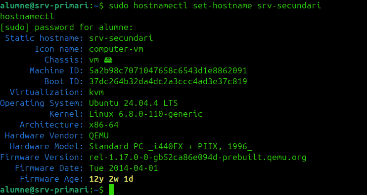

#### 3. Canviar la IP

Edita el fitxer de `netplan`. Per exemple:

```bash
sudo nano /etc/netplan/00-installer-config.yaml
```


O bé:

```bash
ls /etc/netplan/
```

Exemple de configuració per al secundari:

```yaml
network:
  version: 2
  ethernets:
    ens18:
      dhcp4: no
      addresses:
        - 192.168.0.101/24
      nameservers:
        addresses:
          - 8.8.8.8
      routes:
        - to: default
          via: 192.168.0.1
```

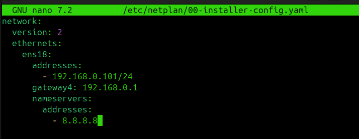

Aplica canvis:

```bash
sudo chmod 600 /etc/netplan/00-installer-config.yaml
sudo netplan apply
ip a
```

Si `netplan apply` dona error, comprova si tens més d'un fitxer YAML configurant la mateixa interfície:

```bash
ls -l /etc/netplan/
sudo grep -R "ens18\\|gateway4\\|routes:" /etc/netplan
```

Si hi ha dos fitxers definint `ens18`, deixa'n només un actiu o elimina la configuració duplicada.

Cas típic després de clonar una Ubuntu Server:

- `00-installer-config.yaml`
- `50-cloud-init.yaml`

Si tots dos configuren `ens18`, tindràs conflictes de ruta o dues IPs a la mateixa interfície.

Solució recomanada:

```bash
sudo mv /etc/netplan/50-cloud-init.yaml /etc/netplan/50-cloud-init.yaml.bak
sudo chmod 600 /etc/netplan/00-installer-config.yaml
sudo netplan generate
sudo netplan apply
```

Si en algun reinici `cloud-init` et torna a generar la xarxa, desactiva la seva gestió de xarxa:

```bash
echo 'network: {config: disabled}' | sudo tee /etc/cloud/cloud.cfg.d/99-disable-network-config.cfg
```

Després comprova:

```bash
ip a
ip route
```

En el `srv-secundari` només hauria de quedar la IP `192.168.0.101/24` a `ens18`.

#### 4. Revisar si `netplan` està lligat a una MAC

Algunes configuracions de `netplan` poden tenir una secció com aquesta:

```yaml
match:
  macaddress: aa:bb:cc:dd:ee:ff
```

Si hi surt la MAC antiga del primari, tens dues opcions:

- canviar-la per la MAC nova del clon
- o eliminar el bloc `match` si no el necessites

Exemple:

```yaml
network:
  version: 2
  ethernets:
    ens18:
      dhcp4: no
      addresses:
        - 192.168.0.101/24
      nameservers:
        addresses:
          - 8.8.8.8
      routes:
        - to: default
          via: 192.168.0.1
```

Després:

```bash
sudo chmod 600 /etc/netplan/00-installer-config.yaml
sudo netplan apply
```

#### 5. Actualitzar `/etc/hosts`

Edita:

```bash
sudo nano /etc/hosts
```

Exemple:

```text
127.0.0.1 localhost
127.0.1.1 srv-secundari
192.168.0.100 srv-primari
192.168.0.101 srv-secundari
```
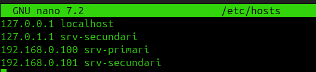

#### 6. Regenerar claus SSH del clon

Això no és obligatori, però és recomanable si voleu que el primari i el secundari siguin dues màquines realment independents.

```bash
sudo rm -f /etc/ssh/ssh_host_*
sudo dpkg-reconfigure openssh-server
sudo systemctl restart ssh
```

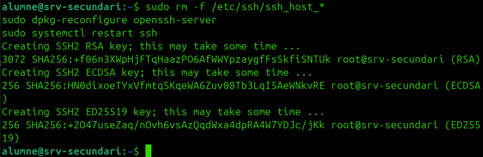

#### 7. Comprovacions finals del clon

```bash
hostnamectl
ip a
ip route
ping 192.168.0.100
ssh auditor@192.168.0.100
```

Quan això funcioni, ja pots arrencar alhora el primari i el secundari sense risc de conflicte bàsic de xarxa.

## Fase 2. Instal·lar els serveis comuns als dos servidors

Executa això tant al primari com al secundari:

```bash
sudo apt update
sudo apt install -y openssh-server apache2 mariadb-server keepalived
```

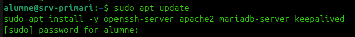

Comprova serveis:

```bash
sudo systemctl enable ssh apache2 mariadb
sudo systemctl start ssh apache2 mariadb
sudo systemctl status ssh
sudo systemctl status apache2
sudo systemctl status mariadb
```

## Fase 3. Configuració comuna dels dos nodes

### 1. Crear usuari de laboratori

Fes-ho als dos servidors:

```bash
sudo adduser auditor
echo 'auditor:auditor123' | sudo chpasswd
```

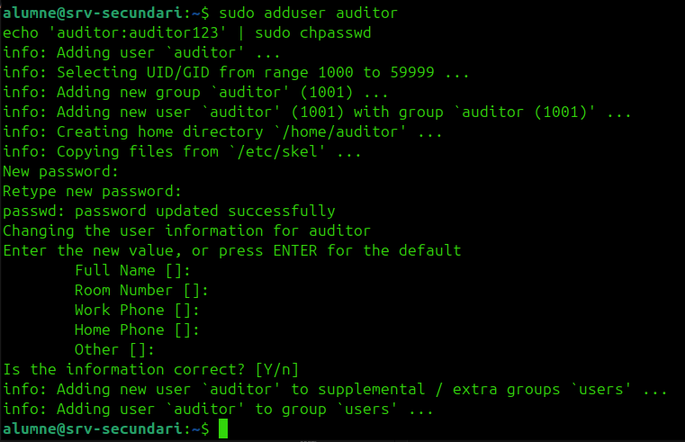

### 2. Crear una web igual als dos servidors

Al `srv-primari`:

```bash
echo "<h1>Srv Primari ASIX</h1>" | sudo tee /var/www/html/index.html
sudo mkdir -p /var/www/html/uploads
echo "fitxer de prova" | sudo tee /var/www/html/uploads/info.txt
echo "copia de seguretat falsa" | sudo tee /var/www/html/backup.sql.bak
```

Al `srv-secundari`:

```bash
echo "<h1>Srv Secundari ASIX</h1>" | sudo tee /var/www/html/index.html
sudo mkdir -p /var/www/html/uploads
echo "fitxer de prova" | sudo tee /var/www/html/uploads/info.txt
echo "copia de seguretat falsa" | sudo tee /var/www/html/backup.sql.bak
```

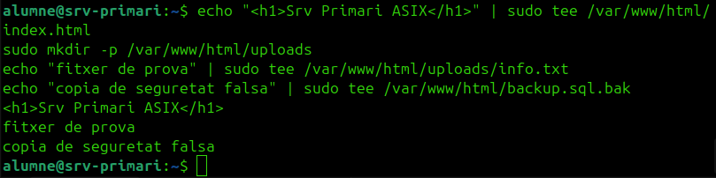


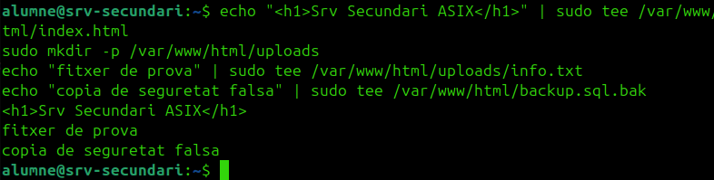

No cal que el text sigui idèntic. De fet, va bé que sigui diferent perquè així podeu demostrar visualment el failover.

### 3. Crear una base de dades de prova

Fes-ho als dos servidors:

```bash
sudo mysql
```

```sql
CREATE DATABASE projecte;
CREATE USER 'projecte'@'%' IDENTIFIED BY '1234';
GRANT ALL PRIVILEGES ON projecte.* TO 'projecte'@'%';
FLUSH PRIVILEGES;
EXIT;
```
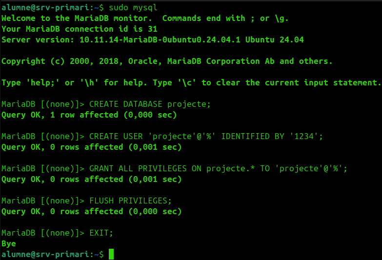

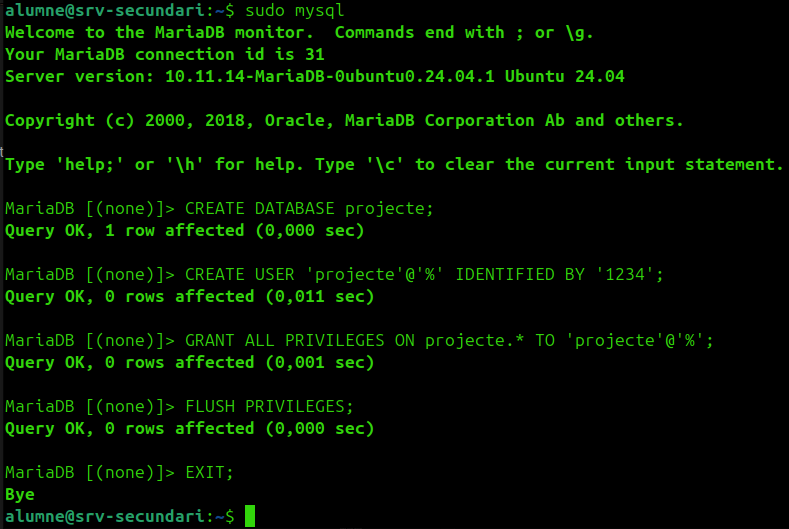

## Fase 4. Vulnerabilitats del primari i del secundari

La idea és tenir vulnerabilitats senzilles, visibles i fàcils de justificar.

### 1. SSH insegur als dos servidors

Edita als dos nodes:

```bash
sudo nano /etc/ssh/sshd_config
```

Deixa actiu:

```text
PasswordAuthentication yes
PermitRootLogin yes
```

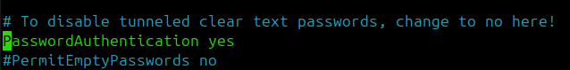


Reinicia:

```bash
sudo systemctl restart ssh
```

Què hauria de detectar la vostra eina:

- port `22` obert
- servei `OpenSSH`
- autenticació per contrasenya habilitada
- hardening pobre

### 2. Apache feble als dos servidors

Edita als dos nodes:

```bash
sudo nano /etc/apache2/apache2.conf
```

Deixa la secció de `/var/www/` semblant a:

```apache
<Directory /var/www/>
    Options Indexes FollowSymLinks
    AllowOverride None
    Require all granted
</Directory>
```

Reinicia:

```bash
sudo systemctl restart apache2
```

Què hauria de detectar la vostra eina:

- port `80` obert
- servidor `Apache`
- headers de seguretat absents
- directori navegable
- fitxer sensible visible (`backup.sql.bak`)

### 3. MariaDB massa exposat als dos servidors

Edita als dos nodes:

```bash
sudo nano /etc/mysql/mariadb.conf.d/50-server.cnf
```

Canvia:

```text
bind-address = 127.0.0.1
```

per:

```text
bind-address = 0.0.0.0
```

Reinicia:

```bash
sudo systemctl restart mariadb
```

Què hauria de detectar la vostra eina:

- port `3306` obert
- servei `MariaDB`
- accés remot habilitat
- usuari amb permisos excessius

## Fase 5. Alta disponibilitat amb Keepalived

Aquesta és la part clau de la pràctica.

### 1. Comprovar la interfície de xarxa

Als dos servidors:

```bash
ip a
```

Apunta el nom de la interfície. En molts casos serà `ens18` o `eth0`.

En els exemples d'aquesta guia faré servir `ens18`. Si la teva és una altra, canvia-la.

### 2. Configuració del primari

Edita:

```bash
sudo nano /etc/keepalived/keepalived.conf
```

Posa això:

```conf
global_defs {
    enable_script_security
}

vrrp_script chk_apache {
    script "/usr/bin/pgrep apache2"
    interval 2
    weight -60
}

vrrp_instance VI_1 {
    state MASTER
    interface ens18
    virtual_router_id 51
    priority 150
    advert_int 1
    authentication {
        auth_type PASS
        auth_pass asixha
    }
    track_script {
        chk_apache
    }
    virtual_ipaddress {
        192.168.0.110/24
    }
}
```

### 3. Configuració del secundari

Edita:

```bash
sudo nano /etc/keepalived/keepalived.conf
```

Posa això:

```conf
global_defs {
    enable_script_security
}

vrrp_script chk_apache {
    script "/usr/bin/pgrep apache2"
    interval 2
    weight -60
}

vrrp_instance VI_1 {
    state BACKUP
    interface ens18
    virtual_router_id 51
    priority 100
    advert_int 1
    authentication {
        auth_type PASS
        auth_pass asixha
    }
    track_script {
        chk_apache
    }
    virtual_ipaddress {
        192.168.0.110/24
    }
}
```

### 4. Reiniciar el servei

Als dos nodes:

```bash
sudo systemctl enable keepalived
sudo systemctl restart keepalived
sudo systemctl status keepalived
```

### 5. Comprovació de la IP virtual

Primer comprova al primari:

```bash
ip a | grep 192.168.0.110
```

Ha d'aparèixer la IP virtual al `srv-primari`.

Després prova l'accés:

```bash
curl http://192.168.0.110
```

## Fase 6. Prova de failover

Aquest és el test que us donarà més joc a la presentació.

### 1. Amb el primari actiu

```bash
curl http://192.168.0.110
```

Hauries de veure la pàgina del `srv-primari`.

### 2. Simular caiguda del primari

Atura `keepalived` al primari:

```bash
sudo systemctl stop keepalived
```

O bé atura Apache:

```bash
sudo systemctl stop apache2
```

### 3. Comprovar el secundari

Al `srv-secundari`:

```bash
ip a | grep 192.168.0.110
```

Ara la IP virtual hauria d'haver passat al segon node.

Des d'una altra màquina:

```bash
curl http://192.168.0.110
```

Hauries de veure la pàgina del `srv-secundari`.

### 4. Recuperar el primari

```bash
sudo systemctl start apache2
sudo systemctl start keepalived
```

## Fase 7. Serveis extra al servidor secundari

Aquests serveis us donaran més superfície d'auditoria, però no són la part principal del HA.

Instal·la al `srv-secundari`:

```bash
sudo apt install -y bind9 vsftpd samba
```

### 1. DNS amb bind9

Idea recomanada:

- `srv-primari`: DNS mestre
- `srv-secundari`: DNS esclau

Vulnerabilitats que podeu simular:

- transferència de zona oberta
- versió del servei visible

### 2. FTP amb vsftpd

Vulnerabilitats recomanades:

- accés anònim activat
- carpeta pública amb fitxers de prova

Exemples de fitxers:

- `inventari.txt`
- `copia.sql`

### 3. Samba

Vulnerabilitats recomanades:

- recurs compartit amb permisos massa amplis
- lectura anònima dins del laboratori

Exemples de fitxers:

- `backup.sql`
- `usuaris.txt`
- `config_old.conf`

## Fase 8. Verificació amb la vostra eina o amb escaneig bàsic

### 1. Escaneig dels dos nodes

```bash
nmap -sV 192.168.0.100
nmap -sV 192.168.0.101
```

### 2. Escaneig de la IP virtual

```bash
nmap -sV 192.168.0.110
```

### 3. Proves manuals útils

```bash
curl http://192.168.0.100
curl http://192.168.0.101
curl http://192.168.0.110
curl http://192.168.0.110/backup.sql.bak
curl http://192.168.0.110/uploads/
```

## Què hauria de detectar la vostra eina

Com a mínim:

- ports oberts
- servei detectat
- IP virtual activa
- servei web redundant
- `SSH` amb configuració dèbil
- fitxers sensibles accessibles al web
- directori web navegable
- `MariaDB` amb accés remot
- `DNS` amb transferència de zona oberta
- `FTP` anònim
- recurs `Samba` amb permisos insegurs

## Evidències per a la memòria

Guardeu:

- captures de `ip a`
- estat de `keepalived`
- resultat abans i després del failover
- sortida de l'escaneig
- proves d'accés al backup des del web

Taula final recomanada:

- servei
- node afectat
- vulnerabilitat
- evidència
- risc
- recomanació

## Mínim viable si aneu justos de temps

Si veieu que no arribeu a tot, jo presentaria això com a mínim:

- `srv-primari` i `srv-secundari` amb `SSH`, `Apache`, `MariaDB` i `keepalived`
- IP virtual `192.168.0.110`
- failover funcional del web
- vulnerabilitats de `SSH`, `Apache` i `MariaDB`
- al secundari, com a extra, `FTP` o `Samba`

Amb això ja podeu defensar:

- alta disponibilitat real
- serveis auditables
- configuracions insegures clares

## Llista curta de control

- [ ] `srv-primari` amb IP `192.168.0.100`
- [ ] `srv-secundari` amb IP `192.168.0.101`
- [ ] `keepalived` instal·lat als dos nodes
- [ ] IP virtual `192.168.0.110` configurada
- [ ] `Apache` funcionant als dos nodes
- [ ] `MariaDB` funcionant als dos nodes
- [ ] usuari `auditor` creat als dos nodes
- [ ] `PasswordAuthentication yes`
- [ ] `PermitRootLogin yes`
- [ ] directori `/uploads/` navegable
- [ ] fitxer `backup.sql.bak` accessible
- [ ] prova de failover feta correctament

## Nota final

No intentis fer una alta disponibilitat perfecta de tot. Per aquesta pràctica, el més intel·ligent és demostrar bé la IP virtual amb `keepalived`, tenir els dos nodes preparats, i afegir unes quantes vulnerabilitats clares perquè la vostra eina d'auditoria pugui lluir.
